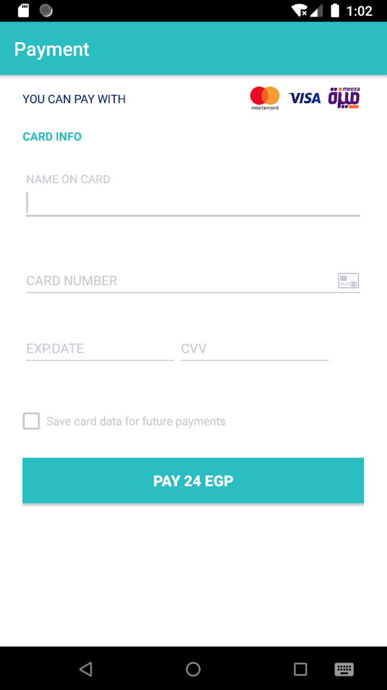

# # Kashier Android SDK

Create seamless checkout experience for your customers !

[Kashier](https://kashier.io/) is a payments platform built to empower
and simplify your business by providing you with
simple and efficient tools to make it easier to
run your business.

- [Features](#Features)
- [Prerequisites](#Prerequisites)
- [API Documentation](https://test-api.kashier.io/api-docs/#/)
- [SDK Installation](#SDK-Installation)
- [Getting Started](#Getting-Started)
- [Save Shopper Card](#Save-Shopper-Card)
- [List Shopper Card](#List-Shopper-Card)
- [Pay With Token](#Pay-With-Token)
  - [Pay with Temp Token](#Pay-With-Temp-Token)
  - [Pay with Perm Token](#Pay-With-Perm-Token)
- [Payment with Card](#Payment-with-Card)
- [Payment With Form](#Payment-with-form)
- [Testing Data](#Testing-Data)
  - [Card Holder Name](#Card-Holder-Name)
  - [Test Cards](#Test-Cards)
    - [Card Numbers](#Card-Numbers)
    - [CVV](#CVV)
    - [Expiry Date](#Expiry-Date)
- [Data Models](#Data-Models)

## Features

- Pay via kashier Payment API
- Save user Card as Token (Perm/Temp)
- List user Cards
- Pay & Save Card via kashier API (One Action)
- Pay With Token via API (Perm/Temp)
<!-- - Pay via Kashier Form. (Coming Soon) -->

# Getting Started

## Prerequisites

You’ll need an **API Key**, and a **Merchant ID**.

To get both
To get those 2 items:

- Login to your [dashboard](https://merchant.kashier.io/en/login)
- Go to **Integrate Now** -> **Customizable Forms** -> **Get the API key**.
  - (Please make sure that you are using the right mode(Live/Test) before copying the API Key).
  - On the top-right corner of the dashboard, you will find your **MID**.

### Verify Transaction Status

- use the [**Authentication endpoint**](https://test-api.kashier.io/api-docs/#/Authenticate)
- Then, use [**Transactions endpoint**](https://test-api.kashier.io/api-docs/#/transactions) to get the transaction.
  - You will need your sent order id and the second parameter is the transaction id

## SDK Installation

Please note that all the methods are of type 'Void'

Please follow below steps to integrate the SDK in your project

- Get our latest SDK version from [release](https://github.com/Kashier-payments/Kashier-Android-SDK/releases).

- Copy kashierSDK.aar file in libs folder. (You may need to switch view to ‘Project’ instead of ‘Android’, you’ll find it under <project_name>/app/libs)

- Open your build.gradle file, specify following and click sync project with Gradle files.

- Open Project level build.gradle and add flatDir{dirs 'libs'} like below.

```JAVA
allprojects {
   repositories {
       jcenter()
       flatDir {
           dirs 'libs'
       }
   }
}
```

- Open app level build.gradle file and add .aar file

```JAVA
dependencies {
    implementation(name: 'kashierSDK', ext: 'aar')
}
```

- Import some dependencies used by the SDK in your build.gradle, use the ones below

```Java
dependencies {
    implementation(name: ‘Kashier_Payment_SDK_1.0.2’, ext: 'aar')
    implementation fileTree(dir: 'libs', include: ['*.jar'])
    implementation 'androidx.appcompat:appcompat:1.1.0'
    implementation 'androidx.constraintlayout:constraintlayout:1.1.3'
    implementation 'com.google.android.material:material:1.1.0'
    implementation 'com.squareup.retrofit2:retrofit:2.6.1'
    implementation 'com.squareup.retrofit2:converter-gson:2.6.1'
    implementation 'com.squareup.okhttp3:logging-interceptor:4.2.0'
}
```

- Sync the Gradle, and you should now be able to use the SDK.

- [Initialize](#Initialization) the SDK

## Initialization

You’ll need to initialize Kashier SDK once in your application,

```java
Kashier.init(
   Context context, String merchantId, String apiKey, String currency, SDK_MODE sdkMode)
```

OR

```java
Kashier.init(
   Context context,
   String merchantId,
   String apiKey,
   String currency,
   SDK_MODE sdkMode,
   KASHIER_DISPLAY_LANG displayLanguage)
```

```JAVA

String currency = "EGP";
String ApiKeyId = "xxxxxxxx-xxxx-xxxx-xxxx-xxxxxxxxxxxx";
String merchantId = "MID-xxx-xxx";
Kashier.init(MainActivity.this, merchantId, ApiKeyId, currency, SDK_MODE.DEVELOPMENT);
```

| Parameters  | Type                           | Description                                 |
| ----------- | ------------------------------ | ------------------------------------------- |
| context     | Context                        | Application context                         |
| merchantId  | String                         | [Merchant ID](#Prerequisites)               |
| apiKey      | String                         | [API Key](#Prerequisites)                   |
| sdkMode     | [SDK_MODE](#SDK_MODE)          | To switch between testing and live modes    |
| currency    | [CURRENCY?](#CURRENCY)         | We Support ISO currencies(EGP, USD, GBP, EUR)                 |
| displayLang | [DISPLAY_LANG?](#DISPLAY_LANG) | To get the translated message from response |

# Save Shopper Card

Use this API to save a user card (Create a token), for later usage as [Pay With Token](#Pay-With-Token)

There are 2 Types of [tokens](#TOKEN_VALIDITY)

- **Temporary**: Used for Multiple page checkout, expires within a limited time
- **Permanent**: Card data is Saved at Kashier, can be used for any future transactions

```Java
saveShopperCard(
   Card cardData,
   String shopperReference,
   TOKEN_VALIDITY tokenValidity,
   final UserCallback<TokenizationResponse> responseCallback)
```

**Example**

```JAVA
Kashier.saveShopperCard(
               new Card("YOUR HOLDER NAME", "XXXXXXXXXXXXXXXX", "XXX", "12", "22"),
               "XXXXXXXXXXX", //SHOPPER REFERENCE
               TOKEN_VALIDITY.TEMPORARY,
               new UserCallback<TokenizationResponse>() {
                   @Override
                   public void onResponse(Response<TokenizationResponse> userResponse){
                       /*Used to set the token value to be used in next request
                        * Both these values can be used later in payment with temp tokenization
                        */
                       String cardToken = userResponse.body().getBody().getResponse().getCardToken();
                       String ccvToken = userResponse.body().getBody().getResponse().getCcvToken();
                       Log.d(null, "cardToken: " + cardToken + " , ccvToken: " + ccvToken);
                   }
​
                   @Override
                   public void onFailure(ErrorData<TokenizationResponse> errorData) {
                       Log.e(null, "onFailure: " + errorData.getErrorMessage());
                   }
               });
```

| Parameters       | Type                                           | Description                                                  |
| ---------------- | ---------------------------------------------- | ------------------------------------------------------------ |
| cardData         | [Card](#Card)                                  | Card Details                                                 |
| shopperReference | String                                         | User Unique ID in your system                                |
| tokenValidity    | [TOKEN_VALIDITY](#TOKEN_VALIDITY)              | Wheter to use a temp or perm token                           |
| responseCallback | TokensListResponseCallback | Callback that returns success or failure for Saving the card |

# List Shopper Card

Used to get a list of previously saved cards
Tokens are saved with one of the following conditions should be available in this api

- Tokens saved with [Save Shopper Card](#Save-Shopper-Card), with [**tokenValidity**](#TOKEN_VALIDITY) set to **PERMANENT**
- Tokens saved with [Payment with Card](#Payment-with-Card), with **shouldSaveCard** set to **true**

NOTE: Temp tokens are not saved, so they are not listed in this API

```java
Kashier.listShopperCards(
   String shopperReference, UserCallback<TokensListResponse> TokensListResponseCallback)
```

**Example**

```JAVA
Kashier.listShopperCards(
       "XXXXXXXXXXX",
       new UserCallback<TokensListResponse>() {
         @Override
         public void onResponse(Response<TokensListResponse> userResponse) {
           try {
             final List<TokensItem> tokenItems = userResponse.body().getResponse().getTokens();
             String[] items = new String[tokenItems.size()];
             for (int i = 0; i < tokenItems.size(); i++) {
               TokensItem tokenItem = tokenItems.get(i);
               items[i] =
                       tokenItem.getCardNumber()
                               + " -- "
                               + tokenItem.getCardExpiryMonth()
                               + "/"
                               + tokenItem.getCardExpiryYear()
                               + "\n"
                               + tokenItem.getToken();
             }
             Log.d(null, items.toString());
           } catch (Exception e) {
             this.onFailure(
                     new ErrorData<TokensListResponse>()
                             .setErrorType(ERROR_TYPE.EXCEPTION)
                             .setExceptionErrorMessage(e.toString()));
           }
         }
​
         @Override
         public void onFailure(ErrorData<TokensListResponse> errorData) {
           Log.d(null, errorData.getErrorMessage());
         }
       });
```

| Parameters                 | Type                                       | Description                                                  |
| -------------------------- | ------------------------------------------ | ------------------------------------------------------------ |
| shopperReference           | String                                     | User Unique ID in your system                                |
| TokensListResponseCallback | TokensListResponseCallback | Callback that returns success with list of cards, or failure |

# Pay With Token

## Pay with Temp Token

Used to pay using a card token created using [Save Shopper Card](#Save-Shopper-Card) with [tokenValidity](#TOKEN_VALIDITY) set to **TEMPORARY**

```java
Kashier.payWithTempToken(
   String shopperReference,
   String orderId,
   String amount,
   String cardToken,
   String cvvToken,
   UserCallback<PaymentResponse> userCallback)
```

**Example**

```java
Kashier.payWithTempToken(
   "xxxxxxxxx",	//SHOPPER REFERENCE
   "xxxxxx",	//ORDER ID
   "622",		//AMOUNT
   "xxxxxxxx-xxxx-xxxx-xxxx-xxxxxxxxxxxx",		//CARD TOKEN
   "xxxxxxxx-xxxx-xxxx-xxxx-xxxxxxxxxxxx",		//CCV TOKEN
   new UserCallback<PaymentResponse>() {
     @Override
     public void onResponse(Response<PaymentResponse> paymentResponse) {
       switch (ResponseHelper.getResponseStatus(paymentResponse.body())) {
         case SUCCESS:
           Log.d(
               null,
               "Trasaction ID: "
                   + paymentResponse.body().getResponse().getTransactionId()
                   + "Order Reference: "
                   + paymentResponse.body().getResponse().getOrderReference());
           break;

         case UNKNOWN:
         case FAILURE:
         case INVALID_REQUEST:
         case PENDING:
         case PENDING_ACTION:
         default:
           Log.d(
               null,
               "Transaction Failed:"
                   + ResponseHelper.getResponseMessageTranslated(paymentResponse.body()));
           break;
       }
     }

     @Override
     public void onFailure(ErrorData<PaymentResponse> errorData) {
       Log.d(null, "Transaction failed: " + errorData.getErrorMessage());
     }
   });
```

| Parameters       | Type                                 | Description                                              |
| ---------------- | ------------------------------------ | -------------------------------------------------------- |
| shopperReference | String                               | User Unique ID in your system                            |
| orderId          | String                               | User Order ID in your system                             |
| amount           | String                               | Amount as a string, with max 2 Decimal digits            |
| cardToken        | String                               | cardToken from [Save Shopper Card](#Save-Shopper-Card)   |
| cvvToken         | String                               | cvvToken from [Save Shopper Card](#Save-Shopper-Card)    |
| paymentCallback  | paymentCallback | Callback that returns success or failure for the payment |

## Pay with Perm Token

Used to pay using a card token created using [Save Shopper Card](#Save-Shopper-Card) with [tokenValidity](#TOKEN_VALIDITY) set to **PERMANENT**

```java
Kashier.payWithPermanentToken(
      String shopperReference,
      String orderId,
      String amount,
      String cardToken,
      UserCallback<PaymentResponse> userCallback)
```

**Example**

```java
Kashier.payWithPermanentToken(
   "xxxxxxxxx",	//SHOPPER REFERENCE
   "xxxxxx",	//ORDER ID
   "622",		//AMOUNT
   "xxxxxxxx-xxxx-xxxx-xxxx-xxxxxxxxxxxx",		//CARD TOKEN
   new UserCallback<PaymentResponse>() {
     @Override
     public void onResponse(Response<PaymentResponse> paymentResponse) {
       switch (ResponseHelper.getResponseStatus(paymentResponse.body())) {
         case SUCCESS:
           Log.d(
               null,
               "Trasaction ID: "
                   + paymentResponse.body().getResponse().getTransactionId()
                   + "Order Reference: "
                   + paymentResponse.body().getResponse().getOrderReference());
           break;

         case UNKNOWN:
         case FAILURE:
         case INVALID_REQUEST:
         case PENDING:
         case PENDING_ACTION:
         default:
           Log.d(
               null,
               "Transaction Failed:"
                   + ResponseHelper.getResponseMessageTranslated(paymentResponse.body()));
           break;
       }
     }

     @Override
     public void onFailure(ErrorData<PaymentResponse> errorData) {
       Log.d(null, "Transaction failed: " + errorData.getErrorMessage());
     }
   });
```

| Parameters       | Type                                 | Description                                                                                       |
| ---------------- | ------------------------------------ | ------------------------------------------------------------------------------------------------- |
| shopperReference | String                               | User Unique ID in your system                                                                     |
| orderId          | String                               | User Order ID in your system                                                                      |
| amount           | String                               | Amount as a string, with max 2 Decimal digits                                                     |
| cardToken        | String                               | cardToken from [Save Shopper Card](#Save-Shopper-Card) or [List Shopper Card](#List-Shopper-Card) |
| paymentCallback  | paymentCallback | Callback that returns success or failure for the payment                                          |

# Payment with Card

Used to pay using card data directly, can be customized with your Payment Form

```java
Kashier.callPaymentAPI(
   Card cardData,
   final String orderId,
   final String amount,
   final String shopperReference,
   final Boolean shouldSaveCard,
   @Nullable UserCallback<PaymentResponse> paymentCallback)
```

**Example**

```java
Kashier.callPaymentAPI(
   new Card("YOUR HOLDER NAME", "XXXXXXXXXXXXXXXX", "XXX", "12", "22"),
   "xxxxx", //ORDER ID
   "242", //AMOUNT
   "XXXXXX", //SHOPPER REFERENCE
   true,
   new UserCallback<PaymentResponse>() {
     @Override
     public void onResponse(Response<PaymentResponse> userResponse) {
       String responseMessage =
           ResponseHelper.getResponseMessageTranslated(userResponse.body());
       RESPONSE_STATUS responseStatus = ResponseHelper.getResponseStatus(userResponse.body());
       switch (responseStatus) {
         case SUCCESS:
           Log.d(
               null,
               "Transaction success: "
                   + responseMessage
                   + userResponse.body().getResponse().getOrderReference());
           break;
         default:
           Log.d(null, "Transaction failed: " + responseMessage);
           break;
       }
     }
     @Override
     public void onFailure(ErrorData<PaymentResponse> errorData) {
       switch (errorData.getErrorType()) {
         case VALIDATION:
           /**
            * Note: Inputs are validated before sending the request, you can use the error
            * details as in the example below to handle the validation on the input fields as
            * per your requirements
            *
            * <p>** The card validation includes luhn check, make sure the card you enter is
            * valid, or passes a luhn check ** The card expiry date includes check for future date
            */
           Log.d(null, "Validation error" + errorData.getValidationErrorsMessage());
           List<ValidationResult> validationResults = errorData.getValidationErrors();
           for (ValidationResult validationResult : validationResults) {
             Log.d(
                 null,
                 "Field: "
                     + validationResult.getValidationField().toString()
                     + ", Field Error: "
                     + validationResult.getValidationErrorCode().toString());
             // TODO: Handle validation error as required here

           }

           break;
         case DATA:
           // Errors like, order already paid, ....
           Log.d(null, "Error in payment" + errorData.getErrorMessage());
           break;

         case NETWORK_NO_INTERNET:
         case NETWORK_TIMEOUT:
         case NETWORK_UNAUTHENTICATED:
         case NETWORK_CLIENT_ERROR:
         case NETWORK_SERVER_ERROR:
         case NETWORK_UNEXPECTED_ERROR:
           // Note: you can handle network errors here,
           Log.d(
               null,
               "Network Error: "
                   + errorData.getNetworkErrorCode()
                   + " , "
                   + errorData.getErrorMessage());
           break;
         case JSON_PARSING_ERROR:
         case EXCEPTION:
         default:
           /**
            * For any other less common errors, make sure you don't display the exception
            * message to the user, it's intended to be used by the developer only
            */
           Log.d(
               null,
               "Unknown expection: "
                   + errorData.getErrorMessage()
                   + " "
                   + errorData.getExceptionErrorMessage());
           break;
       }
     }
   });
})
```

| Parameters       | Type                                 | Description                                              |
| ---------------- | ------------------------------------ | -------------------------------------------------------- |
| cardData         | [Card](#Card)                        | Card Details                                             |
| orderId          | String                               | User Order ID in your system                             |
| amount           | String                               | Amount as a string, with max 2 Decimal digits            |
| shopperReference | String                               | User Unique ID in your system                            |
| shouldSaveCard   | Bool                                 | Wheter to save the card after the transaction or not     |
| paymentCallback  | paymentCallback | Callback that returns success or failure for the payment |

# Payment with Form



To pay with a quick payment form, you can use one of the following APIs

```java
startPaymentActivity(
   Context context,
   String shopperReference,
   String orderId,
   String amount,
   UserCallback<PaymentResponse> paymentTransactionsCallback)
```

OR

```java
startPaymentActivity(
   Context context,
   String shopperReference,
   String orderId,
   String amount,
   UserCallback<PaymentResponse> userCallback,
   @Nullable PaymentActivityConfig paymentActivityConfig)
```

OR

```java
startPaymentActivity(
   Context context,
   String shopperReference,
   String orderId,
   String amount,
   UserCallback<PaymentResponse> paymentTransactionsCallback,
   @Nullable Card card,
   @Nullable PaymentActivityConfig paymentActivityConfig)
```

| Parameters            | Type                                 | Description                                                  |
| --------------------- | ------------------------------------ | ------------------------------------------------------------ |
| activity              | AppCompatActivity                    | Activity                                                     |
| card                  | [Card](#Card)                        | Card Details, can be used to pre-fill fields on payment form |
| orderId               | String                               | User Order ID in your system                                 |
| amount                | String                               | Amount as a string, with max 2 Decimal digits                |
| shopperReference      | String                               | User Unique ID in your system                                |
| paymentCallback       | paymentCallback | Callback that returns success or failure for the payment     |
| paymentActivityConfig | paymentActivityConfig                | Can be used to pass config                                   |

# Testing Data

You can use the following testing data

## Card Holder Name

John Doe

## Test Cards

### Card Numbers

| Test Cards | Card Number      | 3-D Secure Enabled |
| ---------- | ---------------- | ------------------ |
| MasterCard | 5123450000000008 | Yes                |
|            | 5111111111111118 | No                 |
| Visa       | 4508750015741019 | Yes                |
|            | 4012000033330026 | No                 |

### CVV

| CSC/CVV | CSC/CVV Response GW Code |
| ------- | ------------------------ |
| 100     | Match                    |
| 101     | NOT_PROCESSED            |
| 100     | NO_MATCH                 |

### Expiry Date

| Expiry Date | Transaction Response GW Code |
| ----------- | ---------------------------- |
| 05/21       | APPROVED                     |
| 02/22       | DECLINED                     |
| 04/27       | EXPIRED_CARD                 |
| 08/28       | TIMED_OUT                    |
| 01/37       | ACQUIRER_SYSTEM_ERROR        |
| 02/37       | UNSPECIFIED_FAILURE          |
| 05/37       | UNKNOWN                      |

# Data Models

## Enums

### SDK_MODE

```JAVA
public enum SDK_MODE {
  /** Used for development, uses Testing Server */
  DEVELOPMENT,
  /** Used for use in Production environment, uses Kashier Production server */
  PRODUCTION
}
```
### DISPLAY_LANG

```jAVA
	public enum DISPLAY_LANG {
		 AR = "ar"
		 EN = "en"
	}
```
### RESPONSE_STATUS

```JAVA
	public enum RESPONSE_STATUS {
		case
		UNKNOWN,
		SUCCESS,
		FAILURE,
		INVALID_REQUEST,
		PENDING,
		PENDING_ACTION
	}
```

### TOKEN_VALIDITY

```JAVA
public enum TOKEN_VALIDITY {
  TEMPORARY("temp"),
  PERMANENT("perm"),
	}
```